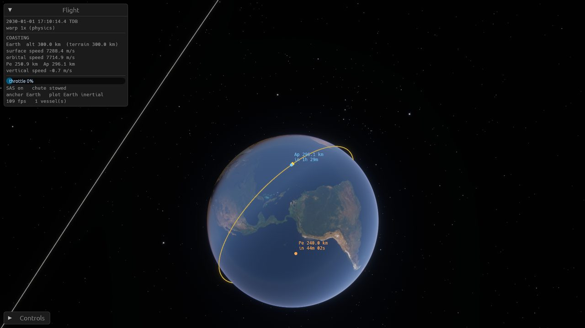
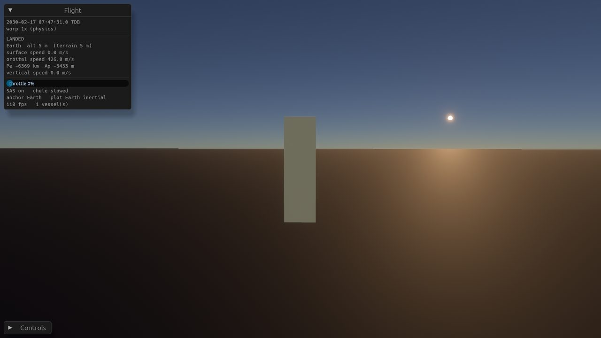

# Sunscatter

Sunscatter is a real-scale spaceflight, mission-design and logistics game. It is being rebuilt from scratch in 3D.

| Version | Status | Where |
|---|---|---|
| **v0.1** | Archived 2D prototype in Rust/wgpu. It is still runnable. | [`archive/v0.1/`](archive/v0.1), whose README has screenshots, features and build instructions |
| **v0.2** | In development. The Earth–Moon flight prototype is playable: launch, orbit, trajectory prediction and parachute landing. Earth and the Moon have real elevation and colour data, with terrain LOD, atmospheric scattering, stars, map mode, five graphics tiers, saves and a tracking station. Ships are still boxes. | [`crates/`](crates), [`docs/`](docs) |

## Running the v0.2 prototype

```bash
cargo run -p game --release          # fly: Z full throttle, W/A/S/D/Q/E steer, P parachute, . and , warp
cargo test -p sim                    # simulation tests (deterministic; CI runs them on macOS and Windows)
SUNSCATTER_DEMO=/tmp/shots cargo run -p game --release   # scripted flight, screenshots of every graphics tier, benchmark tables
```

Other keys:
- F3: graphics settings, including the tier and a benchmark. F4: performance overlay.
- F5 / F9: quicksave / quickload. F6: the save list.
- F7: tracking station. `[` / `]`: previous / next vessel.
- F2: spawn 10 test ships.

The full list is in the in-game Controls panel.




Build plans and their reviews (what works, measurements, what's next):
- [the first prototype](docs/plans/v0.2-earth-moon-prototype.md)
- [the visual pass and foundations](docs/plans/v0.2-visual-pass-and-foundations.md)

## Planning documents

- [Vision](docs/vision.md): identity, pillars, non-goals and roadmap.
- [Process](docs/process.md): documents, research strategy and engineering rules.
- [Decision log](docs/decisions.md): what has been decided, and why.
- [Lessons from v0.1](docs/lessons-from-v0.1.md): what to keep and what to change.
- [Motion model](docs/design/motion-model.md): how bodies and ships move without spheres of influence, plus the analysis of numerical precision.
