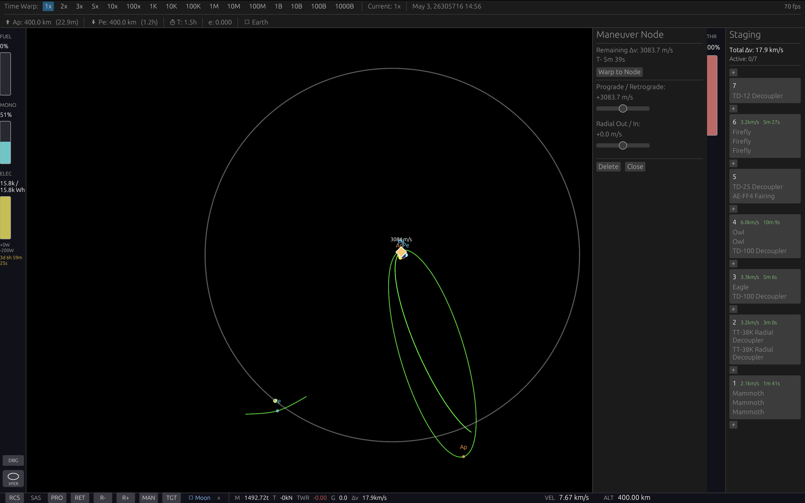
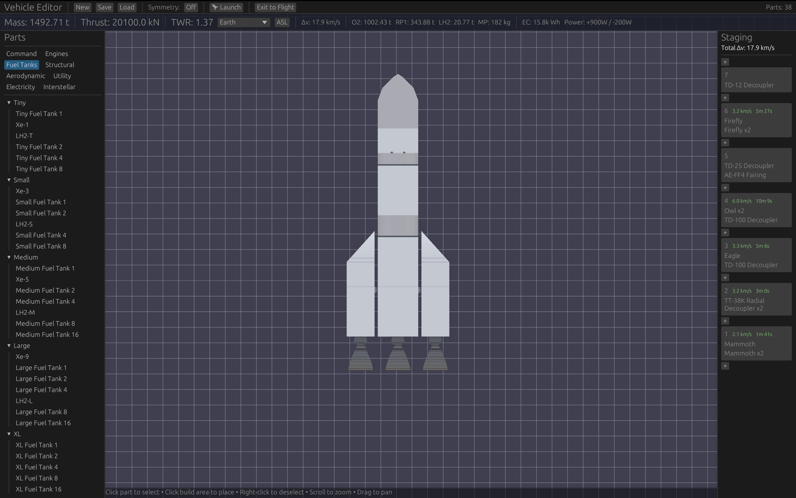
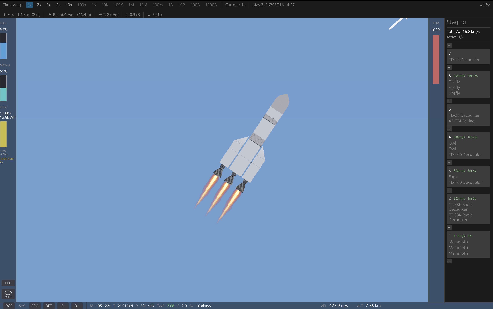
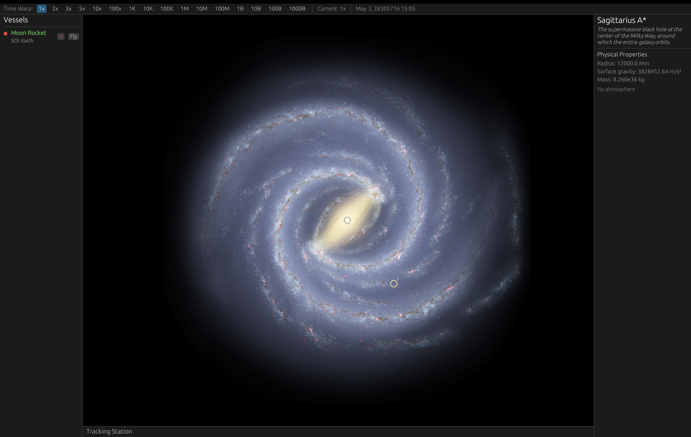

# Sunscatter

A 2D spaceflight and colony game with **1:1 real-scale physics**. You design rockets part by part, launch from Earth, plan transfers with patched conics and Lambert solvers, and set up colonies with production chains. The world model reaches from a 0.5 m build grid out to the scale of the whole galaxy. That lays the groundwork for interstellar travel, but the interstellar gameplay itself is not built yet.

It is written from scratch in **Rust**, with no game engine: wgpu rendering, egui UI and a custom physics loop. It runs **natively and in the browser (WebAssembly)**.



| Vehicle editor | Launch | Galaxy view |
|---|---|---|
|  |  |  |

## Highlights

- **Real scale, no shrinking.** Orbital velocity in low Earth orbit is 7.8 km/s and the Moon is 384,400 km away. The Sun orbits Sagittarius A\* about 26,000 light-years out. World positions are f64 throughout, and time warp runs from 1x to 10¹²x.
- **Patched-conic flight.** Trajectory prediction crosses sphere-of-influence (SOI) boundaries. You get maneuver nodes with an autopilot and auto-warp, a porkchop-plot transfer planner backed by a Lambert solver, and closest-approach markers.
- **Part-based vehicle design.**
  - 167 parts in 10 categories and 5 sizes, with 8 propellant families from kerolox to antimatter and nuclear pulse.
  - Staging is drag-and-drop, with per-stage Δv from the Tsiolkovsky equation.
  - Other flight systems: mirror symmetry, fairings, RCS, aerodynamic drag, per-part heating, radiators, power, shields and crew life support.
- **Relativistic physics.** Thrust tapers off with the Lorentz factor, gravity slows clocks near compact objects, and the ship's clock and Earth's clock run separately. Velocity is shown as a fraction of c above 1%. The physics works, but the interstellar engines that would reach those speeds are rough drafts: they have part definitions, but their numbers and gameplay are not finished.
- **A galaxy to look at and plan around.**
  - There are 22 hand-modeled bodies, from Mercury to Sgr A\*.
  - 67 real nearby star systems come from a catalog.
  - Beyond those, a procedural Milky Way is generated per sector with a fixed seed: an exponential disk, a central bulge, 2 spiral arms, and blackbody star colors.
  - Every star orbits Sgr A\* using a model of how much galactic mass lies inside its orbit.
  - Groundwork for interstellar arrival: a nearby star is added as an ordinary body, so reaching it would use the same SOI code as reaching the Moon. There is not yet a playable way to travel to another star.
- **A colony economy.**
  - 27 building types and 28 resource types, with production chains, power and reactor fuel, and greenhouses.
  - Contracts pay money and science points that fund a 57-node tech tree, and you can launch from any colony that has a launchpad.
  - Trade routes between colonies exist only as a skeleton. Late-game structures such as Dyson swarms and mass drivers are early work.
- **Runs on desktop and in the browser.** A thin platform layer separates the two targets, and the part data is compiled into the binary. On the web, planet textures load lazily over HTTP and saves go to IndexedDB, with import/export to move saves between desktop and web.

## Engineering Notes

These were some of the harder problems:

- **Rendering precision at galactic distances.** GPU vertices are f32, which cannot place a ship precisely when the numbers are galaxy-sized. The camera offset is subtracted in two f64 steps (body center, then the offset relative to it) before converting to f32. This removed jitter, ships snapping to planet centers, and click-picking errors.
- **Trajectory prediction when the gravity is not a point mass.** Near Sgr A\*, the galaxy's gravity comes from mass spread over a large region, so a single Kepler orbit is wrong. Trajectories there are predicted as a chain of short Keplerian arcs. Hyperbolic, retrograde and near-parabolic orbits needed dedicated fixes for anomaly signs, eccentricity clamping and angle wrapping.
- **Stability at 10¹²x time warp.** Mean anomaly grows past 10¹⁰ radians at that speed, so it is wrapped with `rem_euclid(TAU)` before any trig. The camera also had to read positions from the current frame: at this warp, stars move about 3.7×10¹⁵ m per frame.
- **Mixing numerical integration and on-rails orbits.** Up to 10x warp, ships are integrated with Velocity Verlet and sub-stepping. Above that they switch to on-rails Kepler propagation. SOI changes are located by binary search followed by a frame conversion. Warp drops automatically before atmosphere entry.
- **One source of truth for orbital math.** At one point the bodies code and the galaxy code each had their own Kepler solver, and they placed the Sun about 106 light-years apart. They were merged into one solver.
- **Porting to WebAssembly.** The port involved a platform abstraction, embedded assets, lazy loading of about 186 MB of planet textures into a GPU texture array, and a save system shared between desktop and browser.

The codebase is about 55k lines of Rust with 150 passing integration and unit tests. Features are described in 52 behavior specs under [`openspec/specs/`](openspec/specs/game), and design documents are in [`docs/`](docs). Start with [VISION](docs/VISION.md) and the [colony design](docs/colonies.md).

## Building

v0.1 is archived. Run every command from this folder (`archive/v0.1/`), because asset paths are relative to it. The toolchain is pinned in `rust-toolchain.toml` and the dependencies in `Cargo.lock`.

**Native**

```bash
cargo run --release
```

This needs [Rust](https://rustup.rs). On Linux, the native file dialogs also need GTK3.

**Web**

```bash
rustup target add wasm32-unknown-unknown
cargo install trunk
trunk serve --release    # then open http://localhost:8080
```

**Tests:** `cargo test`

## Controls

**Flight**

| Action | Input |
|---|---|
| Throttle up / down | Shift / Ctrl |
| Full / cut throttle | Z / X |
| Rotate | Q / E |
| RCS translate | W / S (fore/aft), A / D (lateral) |
| Toggle RCS | R |
| Stage | Space |
| Switch vessel | [ / ] |
| Focus ship / focus body | Backtick / double-click |
| Maneuver node | Click orbit line |
| Pan / zoom | Drag / scroll |
| Quicksave / quickload | F5 / F9 |
| Pause | Escape |

**Editor**

| Action | Input |
|---|---|
| Place / select / drag part | Left click |
| Rotate part | R |
| Delete | Delete / Backspace |
| Undo | Ctrl+Z |
| Deselect | Escape / right-click |
| Pan / zoom | Arrow keys or drag / scroll |

## Architecture

```
src/
  app.rs, frames.rs   Event loop, input dispatch, per-mode frame rendering
  platform.rs         Native vs. wasm differences (canvas, event loop, resize)
  game.rs             Central game state and the 9 game modes
  bodies.rs           Solar system bodies, Kepler solver, galactic mass model
  ship/               Point-mass physics: integration, orbits, patched conics,
                      SOI transitions, Lambert solver, relativity
  parts/              Part definitions, blueprints, runtime vessel (fuel, staging, Δv)
  editor/             Vehicle editor state, UI, rendering
  colony/             Buildings, resources, economy, trade, contracts, tech, Dyson swarm
  galaxy/             Procedural galaxy + real nearby-star catalog
  render/             wgpu pipeline, camera, scene geometry, HUD and screens (egui)
  save/               RON serialization; native files and IndexedDB backends
data/                 Parts, tech tree, sprites, planet textures (RON / PNG)
tests/                Integration tests (orbits, transfers, relativity, colonies, saves, ...)
tools/                Python sprite and planet-texture generators
```

The tech stack is Rust 2021, wgpu 0.19 (WebGL-capable), winit 0.29, egui 0.27, glam (f64), serde + RON, lyon, rayon and Trunk.

## Status

Development is paused; the last work was in June 2026. The playable core is building, launching, orbiting, transferring between planets, landing, founding colonies and researching tech. Some things are unfinished:

- **You cannot travel to other stars yet.** The galaxy, relativity and star-arrival groundwork exist. The interstellar engines are drafts, and the gameplay loop that would get you there is not built.
- **Trade routes are a skeleton.** The data model and UI exist, but real cargo logistics do not.
- There is no docking yet.
- There are no spaceplanes (wings, lift, runways).
- Balance and progression tuning is incomplete.
- Several designs exist only as documents: laser-sail highways, the "Exodus" countdown scenarios and a narrative campaign.

## License

- **Source code** (`src/`, `tools/`, `Cargo.toml`, `build.rs`): [MIT](LICENSE-MIT)
- **Game assets** (`data/`, `assets/`): [All Rights Reserved](LICENSE-ASSETS)
