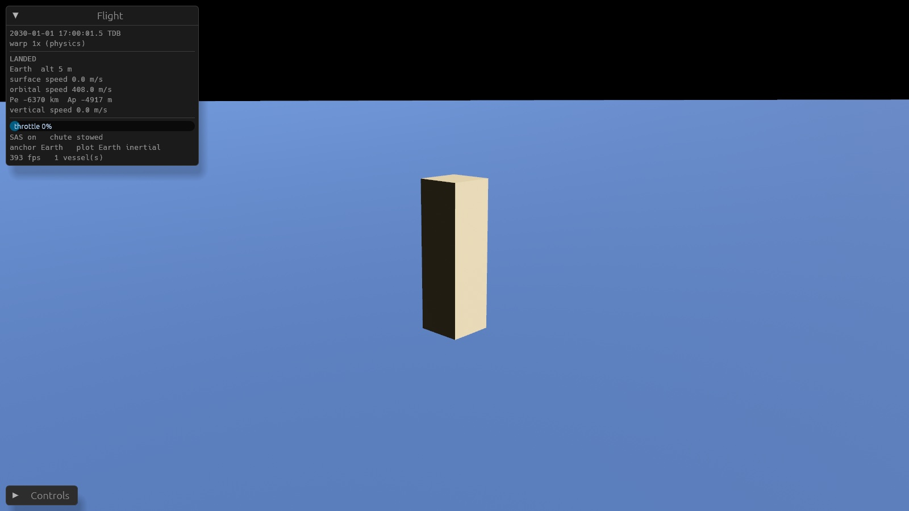

# Plan: Earth–Moon flight prototype (first build of v0.2)

> A single plan for the first build. It covers the work from an empty workspace to a block with magic thrust that launches from Earth, reaches orbit, shows its predicted N-body path, and lands by parachute. Everything runs on the motion model ([design/motion-model.md](../design/motion-model.md)).
> **Priority: correct foundations first**, then the Bevy app that shows them. Graphics stay minimal. The visual direction needs the owner's judgement, so this build doesn't try to settle it.

## Scope

**In scope**
- **Simulation crate:** time and frame types, deterministic math, integrators, and the ephemeris pipeline built on real DE440 initial conditions. It also covers ship dynamics (gravity, Earth's J2, drag, thrust, parachute), coast segments, events, anchors, and the invariance and determinism tests.
- **Bevy app:**
  - **Scene:** Earth, the Moon and the Sun (as a light), plus a ship block.
  - **Rendering:** camera-relative, using our own floating origin.
  - **Camera:** a KSP-style ship view. It orbits the ship on drag and zooms on scroll, and it has focus switching.
  - **HUD:** a minimal display, plus controls and time warp.
  - **Prediction line:** the ship's predicted path, drawn in a choice of two plotting frames.
- **Flight loop:** start on a pad at Cape Canaveral, launch, reach orbit, coast under warp, re-enter, deploy the parachute, and touch down. Oceans count as solid.

**Out of scope for this build:** atmosphere shaders, terrain elevation, parts and the ship model, saves, burns during on-rails warp, map view, scripting, the MCP server, and systems beyond Earth–Moon.

## Architecture

```
Cargo workspace (root)
├── crates/sim        # no Bevy. f64, frame-typed, deterministic (libm only)
│   ├── time          # Epoch = (i64 s, f64 frac) TDB; Duration
│   ├── math          # libm wrappers, compensated summation, Kepler solver, elements <-> state
│   ├── frame         # frame-typed position/velocity newtypes, frame tree, lowest-common-ancestor transforms
│   ├── integrate     # fixed-step symplectic (bodies); adaptive DP5(4) + dense output (ships)
│   ├── ephem         # Ephemeris trait; Linear / Rails(+drift) / Chebyshev table; body catalog
│   ├── gen           # N-body generation + fitting + rails-vs-table classifier (used by the tool)
│   ├── forces        # gravity (point mass + J2), cutoff threshold, exponential atmosphere drag, thrust
│   └── vessel        # vessel state (Landed / Powered / Coasting), coast segments, events, anchors
├── crates/ephem-tool # binary: reads de440s.bsp via ANISE -> runs gen -> writes data/ephemeris/*.bin
└── crates/game       # Bevy app: rendering, camera, input, HUD, prediction jobs
```

**Key rules** (from the lessons and the motion model):
- `sim` never depends on Bevy. The game converts to camera-relative f32 each frame through the frame tree.
- Rendering never integrates. It evaluates stored segments.
- New predictions come from background tasks and replace the old one atomically.
- Time warp only changes how fast simulation time advances.
  - **Physics warp, 1–4x:** used while powered or in atmosphere. Integration uses fixed ticks, and warp runs more ticks per frame.
  - **Rails warp, 10x–1,000,000x:** used only when coasting. It just evaluates the stored segment.
- All simulation trig and exponential functions go through `sim::math` (backed by `libm`). There is no `mul_add`.

## Design choices for this prototype

These are recorded here rather than in the decision log, because they are local to the prototype.

- **Epoch:** 2030-01-01T00:00:00 TDB. The ephemeris window is **2030–2080**. The full 1,000-year window comes later; the pipeline is the same and only the table size changes.
- **Bodies generated:**
  - The Sun, Mercury–Neptune, and the Moon.
  - Earth and the Moon are separate bodies, placed via the Earth–Moon barycenter. All ten are integrated N-body from DE440 states at the epoch.
  - This is the consistent perturber set (D026).
  - The classifier decides rails or table for each body. The Moon is expected to need a table.
- **Body integrator:** a fixed-step Yoshida 8th-order symplectic composition. Its order and conservation are verified by tests. A higher-order multistep method (Quinlan–Tremaine) is a later option.
- **Ship coast integrator:** Dormand–Prince 5(4) plus compensated summation. Dense output is **quintic Hermite** from position, velocity and acceleration at both step ends (simpler than DP's own interpolant and 5th order). It sits behind a trait so DOP853 or IAS15 can replace it after benchmarking.
- **Earth model:**
  - A WGS84 ellipsoid, with J2 gravity.
  - Rotation follows the IAU 2015 model: prime meridian angle plus linear pole precession (the IAU `T` terms). Nutation is ignored. *(Built slightly richer than first planned: the precessing pole is also used for Earth's J2 in the ephemeris generator.)*
  - The atmosphere is exponential, with a 7.2 km scale height up to 150 km and zero above.
- **Moon model:** a sphere (J2 = 2.03×10⁻⁴ acting on vessels), with the IAU 2015 mean rotation (no librations).
- **Gravity cutoff:** sources below 10⁻¹¹ m/s² at the ship are dropped per segment. Venus and Jupiter are *not* cut near Earth. The threshold is tunable.
- **Anchors:** the policy picks the nearer of Earth or the Moon (relative to its radius), with hysteresis. The alternative policy (anchor to the barycenter) is only used by the invariance test.
- **Ship block:**
  - 3 m × 3 m × 10 m, 20 t, magic thrust up to 600 kN, magic reaction torque, and infinite propellant.
  - Drag coefficient times area Cd·A = 7 m² (nose-first). The parachute is **6,000 m²** (changed from 500 m²: 500 m² lands a 20 t block at ~25 m/s), and deploying it is an event.
  - Touchdown is safe below 10 m/s.
- **Plotting frames:** Earth-centred inertial (default) and the Earth–Moon rotating frame. A key toggles between them.
- **Camera:**
  - Orbits its focus. Drag rotates it and scroll zooms, logarithmically.
  - **Focus modes:**
    - *Ship* (the default).
    - *Nearest body*: the camera sits on the body→ship line, just beyond the ship, looking at the body.
    - *A picked body*: double-clicking a body opens a small menu with **Focus**. Backtick returns focus to the ship.
  - There is no map view.

## Steps

### Phase 0: repository setup
- [x] Root Cargo workspace, `rust-toolchain.toml`, tracked `Cargo.lock`, edition 2021
- [x] Short root `CLAUDE.md` with principles, entry points and commands (Claude Code hooks from process.md: **not set up yet**, left for the owner)
- [x] `clippy.toml` (limit on function length) and a check on file length in CI
- [x] GitHub Actions: fmt, clippy, and tests on macOS and Windows, plus the golden determinism hash

### Phase 1: sim foundations
- [x] `time`: Epoch split arithmetic, TDB, conversion to and from calendar dates (tests: round trips, precision at +1,000 years)
- [x] `math`: libm wrappers, compensated accumulator, Kepler solver, orbital elements ↔ state vectors (property tests: round trips for elliptical and hyperbolic orbits, and near e = 0 and e = 1)
- [x] `frame`: frame-typed vector newtypes, frame tree, lowest-common-ancestor transforms (tests: combining frames incorrectly doesn't compile — a `compile_fail` doc-test)
- [x] `integrate`: Yoshida-8 fixed step, DP5(4) adaptive with dense output and stored step state (tests: measured convergence order, energy drift, **chunked == single pass bit-identical**)

### Phase 2: ephemeris pipeline
- [x] `ephem`: trait, Linear, Rails with drift terms, Chebyshev segments (tests: continuity at segment boundaries, analytic derivatives against finite differences)
- [x] `gen`: N-body generation, fitting (rails with drift using least squares; Chebyshev to tolerance), classifier
- [x] `ephem-tool`: download or read `de440s.bsp`, pull states at the epoch with ANISE, generate, write `data/ephemeris/sol-2030.bin` (commit the output only if under about 5 MB; otherwise store it in git LFS or generate it at build time)
- [x] Golden tests against DE440 at +1, +10 and +50 years. Report the error for each body.
- [x] Determinism test: regenerating gives an identical hash; the output hash is committed

### Phase 3: ship dynamics
- [x] `forces`: point-mass gravity plus Earth's J2, cutoff, atmosphere and drag, thrust, and magic torque
- [x] `vessel`:
  - Landed (fixed in the body-fixed frame), Powered (fixed tick) and Coasting (segment)
  - The transitions between them
  - Events: impact or touchdown, atmosphere entry and exit, apsides
- [x] Anchors plus the **anchor-invariance test** (Earth anchor against barycenter anchor, for low Earth orbit and trans-lunar coasts)
- [x] **Warp-invariance test:** stepping the simulation clock at 1x against 1,000,000x samples identical states
- [x] Executable scenarios:
  - [x] Pad → orbit, with a scripted pitch program
  - [x] Low Earth orbit coast for 30 days: the period and J2 nodal precession match analytic values
  - [x] Re-entry → parachute → safe touchdown
  - [x] A trans-lunar coast that reaches the Moon's vicinity

### Phase 4: Bevy app (minimal graphics)
- [x] Window, 4x MSAA, reverse-Z, egui HUD, sim clock resource, warp control
- [x] Rendering relative to the camera: Earth (ellipsoid mesh plus a local tangent patch near the ship to hide the sphere's facets), the Moon, the Sun as a directional light plus a marker (**starfield not done**)
- [x] Ship block, controls (throttle, attitude, SAS, parachute key; throttle alone launches)
- [x] Camera: orbit, zoom, focus on ship or nearest body, double-click body → focus menu
- [x] Prediction: background task → atomic replacement; polyline in the chosen plotting frame; rate-limited while powered
- [x] HUD: time/date, warp, altitude, surface and orbital speed, periapsis and apoapsis (osculating orbit around the display primary), status, frame rate

### Phase 5: verification
- [x] Run the app. Take screenshots of the pad, ascent, orbit with the prediction, the Moon in focus, and the parachute descent (via the scripted demo; see the review)
- [x] Frame rate with 10 or more ships (a debug key spawns them), measured on the reference Mac (D028)
- [x] Review section below: what works, what doesn't, what needs the owner's judgement

## Acceptance criteria

1. `cargo test` passes on macOS, and CI passes on macOS and Windows.
2. The golden errors against DE440 are reported, and the Earth–Moon distance error at +1 year is within 10 m of our own reference integration. (Error against real DE440 is reported separately, because our perturber set is smaller.)
3. The anchor-invariance, warp-invariance, chunked-computation and determinism-hash tests pass.
4. By hand, in the app: launch from the pad, reach orbit, see the prediction, warp at 1,000,000x with no flicker, re-enter, and land by parachute.
5. The app runs at 60 fps or better on the reference Mac with 10 or more ships.

## Review

*Written 2026-09-26 at the end of the first autonomous build session.*

### Status

**Everything in the plan is built and verified, except three items:** a starfield, Claude Code hooks, and the proper Windows run of the app itself (CI builds it on Windows, but nobody has flown it there).




More in [`docs/images/v0.2-prototype/`](../images/v0.2-prototype/): ascent, Moon focus, parachute descent, landed.

### What works (with evidence)

**Simulation (`crates/sim`, 60 tests, all passing on macOS and Windows in CI)**
- **Deterministic across platforms.** Golden hashes for ephemeris generation and for a 2,000-step LEO coast are identical on macOS ARM64 and Windows x86-64, and in debug and release builds. The shipped ephemeris file equals regeneration bit for bit.
- **Ephemeris.** 13 nodes, 50 years (2030–2080), 2.6 MB, generated in 2.9 s. Physics: point masses, the Sun's first post-Newtonian correction, and Earth's J2 about its precessing IAU pole. Every node fits within its tolerance (the Moon's table to 0.2 mm). The classifier chose tables for every Sol body (rails for Sol need the full 1,000-year window to pay off; the synthetic test confirms rails are chosen for a Keplerian body).
- **Accuracy against real DE440** (a bonus, not a requirement, D026):

  | | +1 year | +10 years | +50 years |
  |---|---|---|---|
  | Earth–Sun | 81 m | 730 m | 5.8 km |
  | Mars–Sun | 283 m | 271 m | 35 km |
  | Moon–Earth | 3.8 km | 38 km | 206 km |

  The Moon's residual is almost certainly lunar physical librations and figure coupling, which DE440 integrates. Adding the Moon's J2 alone made it slightly worse, so it was not kept.
- **Ship physics.**
  - J2 nodal regression in LEO matches theory to 0.7% (including third-body effects).
  - Earth- and Earth–Moon-barycenter-anchored coasts agree to under 5 cm. The barycentric anchor agrees to 0.24 m after 3 h, which is its expected precision cost.
  - Chunked integration, warp stepping and pruning are all bit-identical to single-pass.
- **Scenarios.**
  - Pad → 150 × 195 km orbit → a full orbit in one warp jump → de-orbit → parachute landing.
  - A trans-lunar coast passing 10,150 km from the Moon, re-anchoring to it on the way.

**App (`crates/game`, Bevy 0.19.1 + bevy_egui 0.42)**
- **The full loop, flown through the real app** by `SUNSCATTER_DEMO`: launch, orbit, Moon focus, de-orbit, parachute, safe landing. HUD readouts match the sim tests (Pe 250 km / Ap 296 km in the demo orbit; 408 m/s rotational speed at the pad).
- **Performance on the reference M2 Pro** (offscreen 1600 × 900, minimal graphics):

  | Vessels | Warp | Average fps | Worst frame |
  |---|---|---|---|
  | 11 | 1x | ~450 | 4 ms |
  | 11 | 1,000x | ~450 | 3 ms |
  | 11 | 1,000,000x | ~265 | 8 ms |

  At 1,000,000x the effective warp is 999,600x, with no compute limiting. The target (D028) is 60 fps with 10+ ships.
- **What got it there:** lazy ephemeris snapshots (7.3 µs per coast step, half of before), vessels advanced in parallel (they are independent, so this is deterministic), and pruning of passed samples.

### Deviations from the plan
- Parachute area 6,000 m² (see Design choices).
- Quintic Hermite dense output instead of Dormand–Prince's own interpolant.
- The drawn trajectory is resampled from the stored segment at uniform times, instead of drawing raw step points (steps are up to a minute apart, which drew straight chords).
- The demo's performance stage showed that a 150 km-perigee orbit decays within ~46 simulated days (J2 and third-body effects push perigee into the atmosphere). That is correct physics; the demo now uses a 250 × 300 km orbit.
- Screenshots were taken offscreen (`SUNSCATTER_DEMO_OFFSCREEN=1`) because the screen was locked overnight, and a locked macOS screen doesn't present windows.

### Known limitations
- **Graphics are placeholder.** Flat-coloured spheres, no atmosphere, no sky colour (the sky is black even on the pad), no starfield, no textures or elevation data yet (D037).
- **Only the Sun is lit.** The night side is almost black; there is no Earthshine and no city lights.
- **Magic attitude and thrust.** No parts, fuel or mass change.
- **Burns cannot run during rails warp yet (D029).** Rails warp needs zero throttle.
- **No saves.** The exact float round-trip requirement from the motion model is not implemented yet.
- **The anchor-invariance test** covers Earth versus the Earth–Moon barycenter. Moon-anchored invariance is exercised only by the trans-lunar scenario.
- **Coast steps check surface contact** using the step endpoint plus bisection. A grazing dip below the surface *within* one long step would be missed (irrelevant at LEO step sizes, but worth a bound later).

### Needs the owner's judgement
1. **Engine decision (D031).** Bevy worked well. Its reverse-Z depth, egui integration and task pools needed no workarounds, and the only real API friction was changes between versions, handled by reading the crate source. There is plenty of performance headroom. *Recommendation:* adopt Bevy, pinned per milestone.
2. **Visual direction:** atmosphere scattering (Bevy has a built-in Hillaire model with a raymarched mode for views from space), Earth textures and elevation, a starfield, and a lighting and exposure model.
3. **Camera feel and controls:** drag to orbit, scroll to zoom, `F` for the nearest body, backtick for the ship, double-click for the body menu, `Tab` for the plotting frame. Try it: `cargo run -p game --release`.
4. **HUD layout and content.**

### Suggested next steps
1. Decide the engine (above), then the visual pass (atmosphere, Earth textures and elevation, starfield).
2. Burn planner and burns during rails warp (D029), then maneuver and flight-plan tooling (D011).
3. Saves with the exact float round trip and its test.
4. A higher-order coast integrator (DOP853 or Runge–Kutta–Nyström 12(10)), chosen by benchmark against the current 84 steps per LEO orbit.
5. Claude Code hooks (`cargo check`, clippy and the sim tests on edit and stop) as promised in `process.md`.
