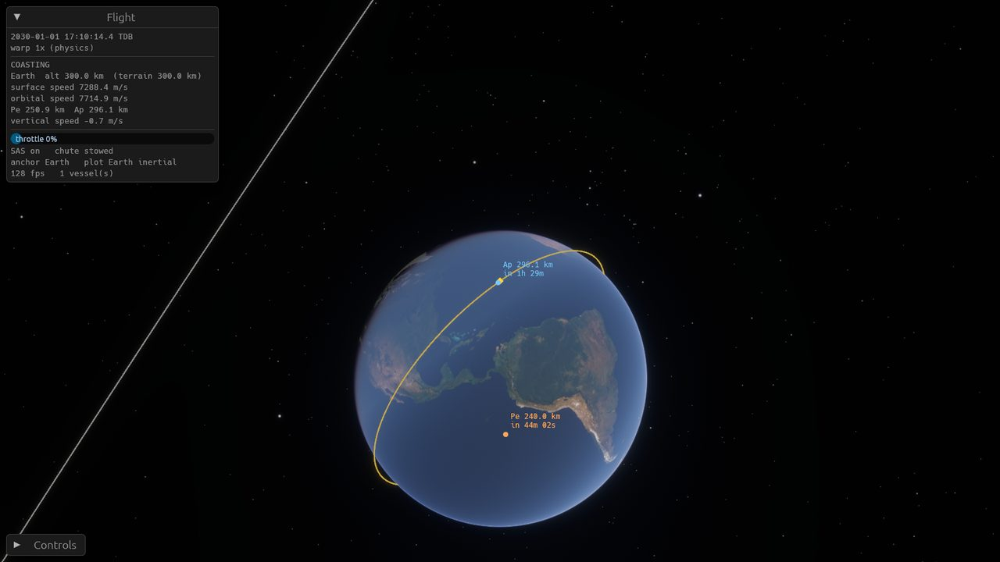
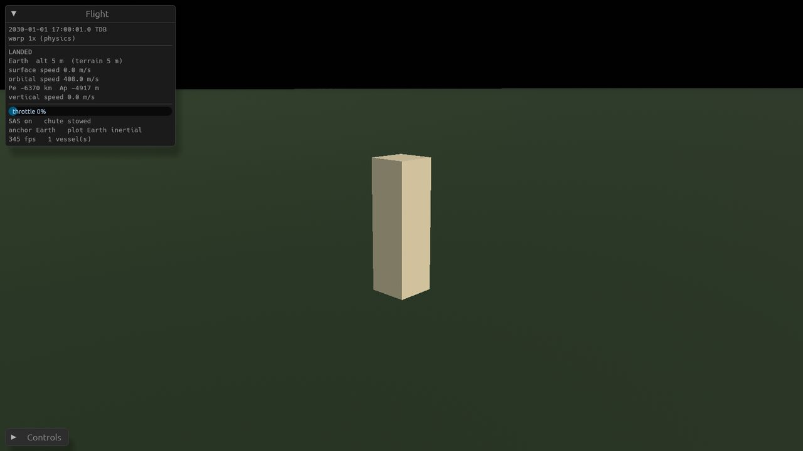
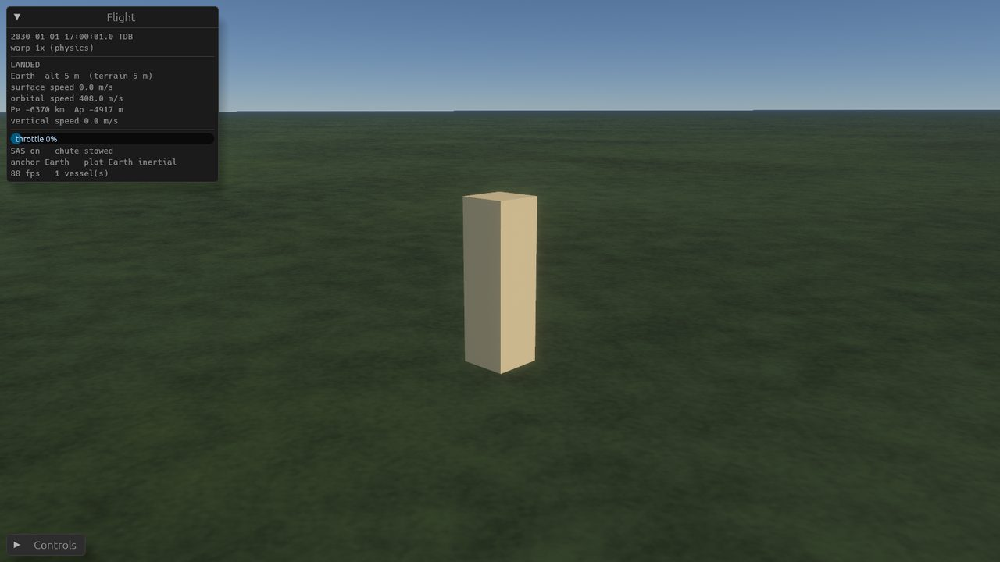
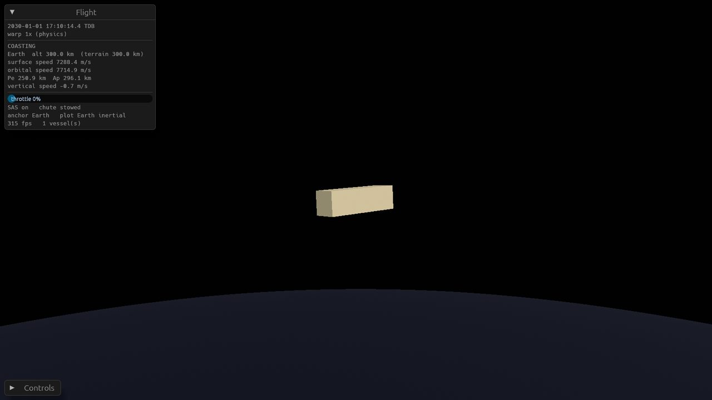
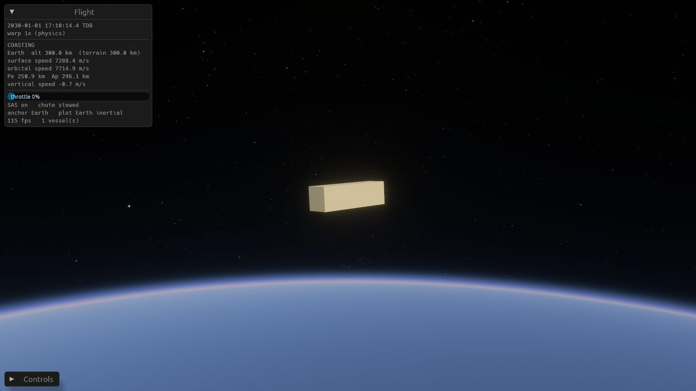
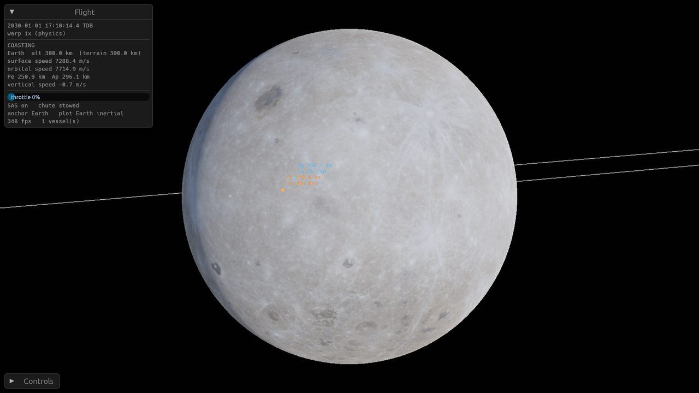
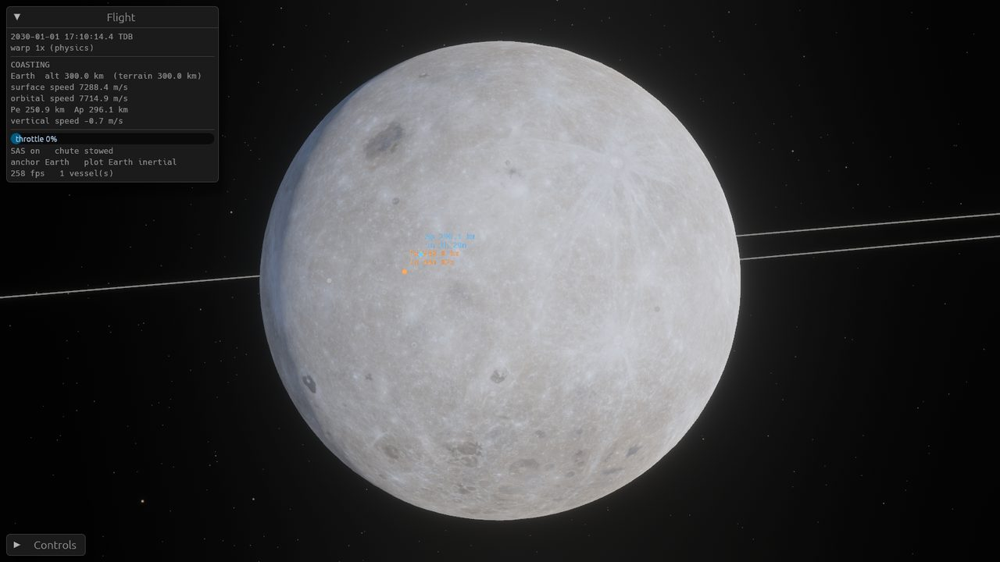
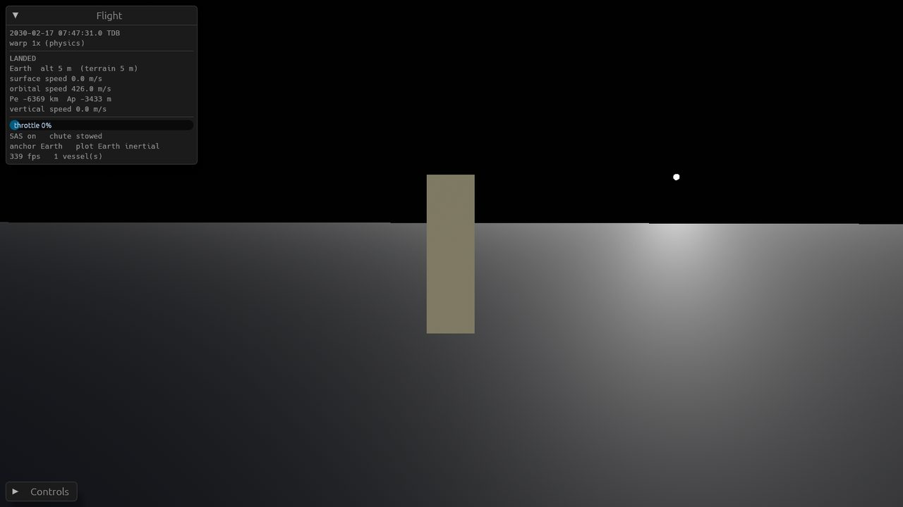

# Plan: visual pass and foundations (second build of v0.2)

> This follows [v0.2-earth-moon-prototype.md](v0.2-earth-moon-prototype.md), which is built and reviewed. Its scope comes from the owner's feedback on 2026-09-26 and decisions D045–D050.
> **Order:** the visual pass first, then foundations. **No maneuver planning yet.**
> The owner judges the visuals from screenshots of every tier, so produce them.
> Numbers the owner gave are drafts: change them if something works better, and record why here.

## Principles for this build
- **Every visual is data-driven for any body (D048).** A new body gets its looks from data (RON plus assets), not new code.
- **Five tiers: Minimal, Low, Medium, High, Ultra.** Each is a preset over individual feature toggles, and every toggle stays available on its own.
  - Minimal ≈ today's cost.
  - Ultra ≈ KSP1 with visual mods (Scatterer, EVE without clouds, textures and terrain).
  - All tiers are highly optimized.
- **Measure what costs performance.** Every feature gets a frame-time cost on the reference M2 Pro. Extend the demo's performance stage to run each tier, and each feature toggled alone against Minimal. Record a table in this plan's review.
- **Sim changes follow the motion model.** Terrain sampling in `sim` is deterministic: plain IEEE arithmetic on committed integer data, with no platform trig in the lookup path. Golden hashes must keep passing on macOS and Windows.
- Keep files under the 700-line limit, commit small, push often, and keep CI green (`--locked`).

## Part A: visual pass

### A1. Settings and tiers
- [x] A `GraphicsSettings` resource: the tier plus individual toggles and quality knobs (terrain LOD distance, atmosphere mode, texture detail, star count, bloom and flare, shadows, MSAA).
  - *Done:* `crates/game/src/settings.rs`. Knobs: terrain elevation on/off, terrain error in pixels, colour-map size cap, detail layer, atmosphere (off / lookup tables / raymarched), ocean glint, faintest star magnitude, bloom, flare, shadows, MSAA (off/2x/4x), Earthshine. Terrain LOD is driven by a pixel-error target rather than a distance, which scales with resolution and field of view.
- [x] A settings window (key suggestion: F3), plus an on-screen performance overlay (fps, frame time, per-feature costs when available).
  - *Done:* F3 opens the window, F4 the overlay. The window can run the full benchmark from the current view and copy the table as Markdown.
- [x] Tier presets. Switching must be live, with no restart.
  - *Done.* `SUNSCATTER_TIER=<name>` picks the starting tier.

### A2. Body visuals as data
- [x] A per-body visual definition in RON: colour maps (coarse and fine), heightmap, height scale and sea level, detail-texture settings, atmosphere scattering parameters, emissive/flare settings for stars.
  - *Done:* `data/bodies/<body>/visual.ron` (`crates/game/src/body_visual.rs`): base colour, colour map, roughness, albedo, icon colour, ocean (roughness, tint), detail layer (scale, strength, rock colour, snow line), atmosphere (absolute scattering coefficients and scale heights, ozone layer, ground albedo) and emission (colour, render luminance, illuminance at 1 AU). The heightmap and sea level come from the physical data, so there is one source for them.
- [x] Generic rendering code that reads it. Earth, the Moon and the Sun use it. No `match name` in rendering code.
  - *Done*, except that the Earth–Moon rotating plotting frame still looks the two up by name (it is an Earth–Moon frame by definition).
- [x] (Coordinates with B2 "bodies as data": physical data goes in sim, visual data in game. They may share one file per body with separate sections.)
  - *Choice:* two files per body, `body.ron` (sim) and `visual.ron` (game). Separate files let the sim and the game change independently and avoided edit conflicts while two agents worked in parallel.

### A3. Elevation and colour data (committed, D046)
- [x] A tool (in `ephem-tool` or a new `asset-tool`) that downloads sources into `data/external/` and bakes the committed assets, so the pipeline can be reproduced:
  - **Earth heights:** ETOPO 2022 (NOAA, public domain), including bathymetry.
  - **Earth colour:** NASA Blue Marble Next Generation (public domain).
  - **Moon heights:** LRO LOLA global DEM (NASA, public domain).
  - **Moon colour:** LROC WAC global mosaic (NASA/ASU, public domain).
  - *Done:* `crates/asset-tool`. `cargo run -p asset-tool --release -- <earth|moon|stars|all|check>` downloads with `curl` into `data/external/` (skipped if present), bakes, and `check` prints spot heights. The regeneration steps are in the crate's doc comment.
- [x] Budget: each committed file under ~50 MB, about 60 MB total.
  - Heights: 16-bit PNG or a custom compressed format, aiming at ~8192×4096 for Earth if it compresses under budget, otherwise ~5400×2700. Moon similar.
  - Colour: JPEG or KTX2 around 8192×4096 if it fits.
  - Record the chosen resolutions and sizes here.
  - **Format.** All maps are equirectangular with w = 2h. The left edge is −180° (east-positive) and row 0 is the north edge; pixels are centred at `lon = −180° + (i+0.5)·360°/w` and `lat = 90° − (j+0.5)·180°/h`. Heights are 16-bit grayscale PNG with `u16 = round(m) + 32768` (signed metres, 1 m steps, zlib level 9 with adaptive filtering). Colours are sRGB JPEG at quality 90. All resampling is an area average (box filter); colour is averaged in linear light.
  - **Chosen:** four body files, 60.3 MB in total:

    | File | Size | Bytes | Source |
    |---|---|---|---|
    | `data/bodies/earth/height.png` | 8192×4096 (4.9 km/px) | 37.2 MB | [ETOPO 2022 60″ surface GeoTIFF](https://www.ngdc.noaa.gov/mgg/global/relief/ETOPO2022/data/60s/60s_surface_elev_gtif/ETOPO_2022_v1_60s_N90W180_surface.tif) (21600×10800 f32, includes bathymetry) |
    | `data/bodies/earth/color.jpg` | 8192×4096 | 4.2 MB | [Blue Marble NG, July 2004, base](https://assets.science.nasa.gov/content/dam/science/esd/eo/images/bmng/bmng-base/july/world.200407.3x21600x10800_geo.tif) (21600×10800 lossless GeoTIFF) |
    | `data/bodies/moon/height.png` | 4096×2048 (2.7 km/px) | 11.6 MB | [LOLA LDEM_64, CGI Moon Kit](https://svs.gsfc.nasa.gov/vis/a000000/a004700/a004720/ldem_64_uint.tif) (23040×11520 u16, half-metres + 20000) |
    | `data/bodies/moon/color.jpg` | 8192×4096 | 7.3 MB | [LROC WAC, CGI Moon Kit 2025 colour map](https://svs.gsfc.nasa.gov/vis/a000000/a004700/a004720/lroc_color_16bit_srgb_8k.tif) (8192×4096, 16-bit sRGB) |

  - **Why these sizes.**
    - Earth heights at 8192 fit the per-file limit, and Earth matters most in milestone 1 (launch and parachute landing, D038).
    - Moon heights at 8192 would be 42.5 MB (91 MB in total), so the Moon uses 4096. The measured alternatives were 5760×2880 at 22.1 MB, 6144×3072 at 24.9 MB, and Earth at 5760/6144 at 19.4/21.9 MB. If the budget grows, rebake with `--height-width 8192` (Moon 8192 = 42.5 MB).
    - The Moon heightmap is the noisier one: 1 m steps on rough terrain compress poorly.
  - **Source choices.**
    - The Blue Marble *base* variant has no baked relief shading (we light it ourselves), plain dark ocean, no clouds and no sea ice.
    - July: northern-hemisphere summer, so the most land is snow-free and green; Antarctica is ice regardless.
    - The Moon Kit 2025 colour map was chosen over the 2019 `lroc_color_poles_*` because its polar fill is much better and it keeps more colour. Its maria contrast is a little lower, which the renderer can adjust.
    - Both Moon Kit maps are centred on 0° longitude, which matches our convention.
  - **Reference surfaces.**
    - Earth heights are relative to ETOPO's EGM2008 geoid (mean sea level). We treat that as the WGS84 ellipsoid and ignore the undulation (±100 m).
    - Moon heights are relative to the 1,737,400 m sphere.
  - **Spot checks** (`asset-tool check`):
    - Earth:
      - Everest: 7,059 m. This is the area average of a 4.9 km pixel; the peak itself is lost at this resolution, and the 3×3 neighbourhood spans 5,272–7,059 m. The global maximum is 7,170 m.
      - Challenger Deep: −10,313 m (3×3 down to −10,372; the global minimum is −10,649).
      - LC-39A: 0 m (3×3 −10..1). Dead Sea: −427 m.
    - Moon (east–west profile through Tycho, 43.31°S 11.36°W):
      - floor about −3.2 to −3.4 km;
      - central peak −1.8 km;
      - rim +1.0 to +1.3 km at 40–50 km from the centre.
      - The global range is −9,064 to +10,654 m.
    - Previews confirmed the orientation: north is up, Africa is just right of centre, and the Moon's near-side maria are around 0° longitude.
- [x] **Coarse and fine textures.**
  - *Coarse* is the global colour map, so the body looks right from orbit.
  - *Fine* is a procedural or tiling detail layer blended in as the camera gets close: a simple surface with slope/height-based variation (rock, regolith, sand, grass or snow for Earth by latitude and height), so landing looks like a surface. It is still simple.
  - *Done:* the colour map is looked up per fragment from the body-fixed direction, so there are no seams or pole artefacts; mip levels come from a CPU chain built in linear light. The detail layer is tileable value-noise fbm in face-local coordinates. It gives brightness variation (three scales, the finest only within a few hundred metres), hue patches, rock colour on slopes, and snow above a snow line that falls with latitude. It fades out beyond ~400× its feature size. It is simple on purpose; a tiling texture set is the natural next step.

### A4. Terrain rendering
- [x] Replace the sphere and ground patch with a chunked cube-sphere quadtree LOD, generic for any body with a heightmap.
  - *Done:* `crates/game/src/terrain/`. The cube sphere uses a tangent warp. Chunks are 33×33 vertices plus skirts. Splitting follows a pixel error: vertex spacing times 0.01, plus 0.1 while the spacing is coarser than the heightmap. Beyond the horizon nothing splits; the deepest level is 19 (~5 m spacing on Earth). A node splits only once all four children are built, so there are never holes. Builds run on the async pool, 16 new per frame and 64 in flight. Unused chunks are evicted after 240 frames.
  - Heights come from `sim::terrain` through `BodyPhysical`, so the drawn ground is the physical ground.
  - Bodies with an atmosphere tessellate until triangles sag less than 50 m below the ellipsoid. Bevy's raymarched atmosphere ends its rays at the geometry depth, and coarse chunks showed a faint grid.
  - Chunk origins are f64 and camera-relative (the floating-origin rule).
  - Skirts or stitching hide cracks.
  - Build chunks on background tasks with a budget.
- [x] Earth oceans: render sea level as the surface where height < 0, with a simple water shading (specular sun glint on High and above). Physically, the sea is solid at sea level (D037).
  - *Done.* Terrain more than 5 m below sea level is shaded as water, with a tint and low roughness when glint is on. Shallower points, such as LC-39A at −3 m, are raised to sea level but shaded as land.
- [x] Minimal tier: coarse sphere plus colour map, no displacement (or very low LOD).
  - *Done:* the same LOD without displacement, with a 2048-pixel colour map.

### A5. Atmospheric scattering ("Scatterer")
- [x] Physically based scattering for any body with an atmosphere, working from the ground to orbit.
  - *Done with Bevy 0.19's built-in atmosphere.* It supports several planets placed by transform (the camera uses the nearest), so it works with our floating origin. Low uses lookup tables; Medium and above use the raymarched mode, which is needed from orbit. The medium is built from absolute scale heights in the data. Bevy's `ScatteringMedium::earth` swaps the Mie absorption and scattering coefficients relative to Hillaire's paper; our data uses the paper's values.
  - *Two Bevy bugs worked around* (`crates/game/src/atmosphere.rs`). Removing a camera's `AtmosphereSettings` leaves stale render state behind (a grey sky), and after an MSAA change it crashes with a pipeline sample-count mismatch. "Off" therefore removes the bodies' `Atmosphere` components, and a render-world system drops the stale per-view offset. These are worth reporting upstream.
  - Try Bevy 0.19's built-in atmosphere first (Hillaire lookup tables, raymarched mode for space views).
  - If it can't handle multiple bodies or our floating origin at planet scale, write a custom one using Hillaire 2020 lookup tables (reference: `webgpu-sky-atmosphere`, MIT).
- [x] Coverage: sky colour, sunsets, aerial perspective on terrain, and the limb glow seen from orbit.
  - Sky light comes from Bevy's atmosphere environment map. The lookup-table mode (Low) barely shows the limb from far away; this is a known limit of that mode.
- [x] The Moon has no atmosphere and must stay crisp.

### A6. Sun, stars, lighting
- [x] Sun flare and glare: bloom plus a lens-flare pass, with the flare fading when a body occludes the Sun.
  - *Done:* bloom from Bevy on Medium and above. The flare (High and above) is an additive glow, streak and ghosts painted behind the UI, faded by the fraction of nine disc samples that bodies hide.
- [x] Starfield from the Yale Bright Star Catalog (public domain, ~9,000 stars): correct positions and magnitudes, with colour from B−V. It must also look right in daylight when the atmosphere is bright.
  - *Rendering done:* `crates/game/src/sky/stars.rs`. Stars are drawn in their J2000 directions, which are our inertial axes, as pixel-sized Gaussian billboards. Brightness is the square root of flux, and colour comes from B−V (Ballesteros temperature, then a blackbody approximation). They fade inside a sunlit atmosphere, and the atmosphere adds its sky light on top.
  - *Data done:* `data/stars/bsc5.ron` holds 9,096 stars, 443 kB. Its format is `(stars: [(ra, dec, vmag, bv), ...])`, J2000 equatorial, in radians. It comes from [VizieR V/50 `catalog.gz`](https://cdsarc.cds.unistra.fr/ftp/V/50/catalog.gz); the 14 entries without positions are skipped, and a missing B−V becomes 0.6. Regenerate with `asset-tool stars`.
- [x] Exposure and tonemapping so the day side, night side and space all read well. Optional Earthshine on the Moon and on ships (High and above).
  - *Done:* physical light units (128,000 lux at 1 AU, falling off as 1/r²), an HDR camera with a fixed EV 14.5 and Bevy's default tonemapping. Earthshine is a second directional light from the body reflecting the most sunlight onto the camera (Lambert sphere, albedo from data). A small ambient floor keeps night sides from being pure black on screen.
  - *Open:* auto-exposure (eye adaptation) could replace the fixed EV. The night side of Earth is realistic but very dark.
- [x] No clouds yet.

### A7. Map mode and orbit display (D049)
- [x] **Automatic map mode:** on when the active ship's projected size is < ~1 px (with hysteresis).
  - *Done:* it turns on below 1 px for a nominal 10 m ship and off above 2 px (`crates/game/src/map.rs`). Outside map mode no trajectories are drawn.
  - In map mode: draw orbit lines, the ship icon, and body icons for bodies smaller than 1 px.
  - Outside map mode: none of those.
- [x] **Orbit lines:**
  - The ship's stored segment (as now).
  - Every fully simulated body, over one period about its parent, from the ephemeris. Draw it in a frame that makes sense for the plotting frame.
  - Tracked vessels.
  - Fade or cull lines by screen size.
  - *Done.* Bodies' orbits are sampled from the ephemeris over one period, or from the osculating conic past its end. Which orbits are shown depends on context, as in KSP: inside a body's anchor zone, its moons' orbits (and, near a moon, that moon's own orbit); outside all zones, the planets'. They fade in between 12 and 60 px. The ship's line covers one revolution: several revolutions drew nearly overlapping parallel lines (already visible in the prototype).
- [x] **Ap/Pe markers** on the ship's trajectory: the actual extrema of distance to the primary along the stored segment (N-body, not conics), labelled with altitude and time to reach.
  - *Done:* local extrema of 600 samples, each refined by a parabola through its neighbours (`trajectory::apsides`).
- [x] **Hover:** hovering over a body, its icon, a ship or its icon shows the name and a highlight ring. Double-click keeps opening the body menu.
- [x] **Trackpad zoom:** 3–5x slower. Scale `MouseScrollUnit::Pixel` deltas separately from line deltas. Keep mouse-wheel feel.
  - *Done:* each pixel counts as a quarter of a wheel line; the wheel is unchanged.

## Part B: foundations

### B1. Saves and settings
- [x] Save format: versioned, with exact f64 round trip (store bits or shortest round-trip text).
  - `sim::save::SaveGame { version, ephemeris: EphemerisId { generator, hash }, clock, vessels, active, controls }` as RON text (`SAVE_VERSION = 1`; other versions are rejected). It serialises the sim types directly, so changing a saved type means bumping the version.
  - **Shortest round-trip text, not hex bits:** Rust prints the shortest decimal that parses back to the same f64, and RON parses with correct rounding. Saves stay readable and diffable. `save::tests::f64_text_round_trips_every_bit_pattern` checks 200,000 random bit patterns plus −0.0, subnormals, extremes and infinities.
  - The ephemeris identity is its generator string plus FNV-1a of its bytes. `SaveGame::read` refuses a save made with a different ephemeris; `from_ron` + `check_world` let the caller decide.
- [x] A test: save → load → propagate gives bit-identical results to propagating without the save.
  - `tests/save_load.rs`: coasting (with look-ahead samples), landed then lift-off, and mid-powered flight with the vessel trailing the clock by part of a tick, then engine cut into a new coast. Also a file round trip and the ephemeris check.
- [x] Quicksave F5 and quickload F9, plus a save list. *(Game side.)* **API for the game:** `SaveGame::capture(&world, clock, &fleet, active, controls)`, then `.write(path)` (atomic via a temp file); `SaveGame::read(path, &world)?` returns the state to put back (`vessels`, `active`, `clock`, `controls`). `to_ron()` / `from_ron()` work on strings. Warp and camera are game state and are not in the save; wrap `SaveGame` in a game struct if they should be.
  - `crates/game/src/saves.rs`: F5 quicksaves to `quicksave.ron`, F9 loads it, F6 opens the save list (newest first, file time in UTC; Load, Delete, and "Save as…" with a name field). A brief egui message confirms or shows the error; a failed load leaves the game untouched.
  - Loading sets warp to 1x, drops the prediction, and tracks every vessel again. Camera, warp and the tracked set are not saved (no game wrapper around `SaveGame` yet).
  - Saves live in `<data_dir>/saves/*.ron` (`directories` crate, `ProjectDirs::from("", "", "Sunscatter")`; on macOS `~/Library/Application Support/Sunscatter/saves`). `SUNSCATTER_HOME=<dir>` overrides the root: `<dir>/saves` and `<dir>/settings.ron`.
  - Tests: `saves::tests::save_list_load_round_trip` (game-layer save → load equals the fleet bit for bit, a failed load changes nothing, wrong version rejected), name sanitising, time formatting.
- [x] Coasting segments either re-derive on load from the saved integrator state, or are stored. Document the choice and test it against the chunked == single-pass guarantee.
  - **Stored.** A coasting vessel saves its segment: the samples from its current time on (older ones are already pruned) plus the full integrator state, including the compensated-sum terms and the next step size. Continuing it after loading is the same computation as never saving. Re-deriving would mean re-integrating from the segment's start, which can be years back.
  - `chunked_extension_across_a_save_equals_single_pass`: 700 steps, save, load, 1,300 steps equals 2,000 steps in one go.
- [x] Settings (graphics tier and toggles, controls) persisted in the platform config directory.
  - `crates/game/src/persist.rs`: `<config_dir>/settings.ron` (macOS `~/Library/Application Support/Sunscatter/settings.ron`) holds `(graphics: GraphicsSettings, controls: ControlsSettings)`. Loaded at startup; a missing file gives defaults and an unreadable one gives defaults with a warning. Missing fields take defaults (`#[serde(default)]`), so older files keep working.
  - Written when the values change, at most once a second, never while the benchmark has swapped them. With `SUNSCATTER_DEMO` set, settings are neither loaded nor saved.
  - Controls: only `trackpad_zoom_speed` exists so far (used by the camera). It has no UI yet and can be edited in the file. There are no key bindings to persist yet.

### B2. Bodies as data
- [x] Move physical body definitions (shape, J2, rotation model, atmosphere, anchor zones, surface/heightmap reference) from Rust constants into RON.
  - `data/bodies/<body>/body.ron` (lower-case ephemeris name). Sim reads only the `physical: (...)` section and ignores any other section (the game's `visual`). Unknown fields are ignored too.
  - Angles are in degrees and rates in IAU units (deg/day, deg/century). They are converted on load with the same arithmetic as the old constants, so the values are bit-identical (`body::data::tests::shipped_bodies_are_bit_identical_to_the_former_constants`), and every golden hash is unchanged, including the ephemeris one (`sol::gen_config` reads Earth's J2 and rotation from the file).
  - New fields: `solid` (landing/impact surface, replaces the `name != "Sun"` check), `sea_level` (`Some(0.0)` for Earth), `heightmap` (path relative to the body directory), `relativistic`, `anchor_zone`.
- [x] `World` is built from data. Adding a body needs only data, plus an ephemeris entry.
  - `World::from_dir(eph, dir) -> Result<World, DataError>`; `World::sol(eph)` loads `body::default_bodies_dir()` (this source tree's `data/bodies`). Bodies without a file are point masses. `body::earth()/moon()/sun()` remain as convenience loaders.

### B3. Terrain physics (D047)
- [x] Deterministic heightmap sampling in `sim` (bilinear on the committed int16 grid).
  - `sim::terrain::Heightmap` decodes the A3 PNG contract with the pure-Rust `png` crate. `sample(lat, lon)` is bilinear between pixel centres; longitude wraps and latitude clamps. `height_at(dir)` gets latitude and longitude from `sim::math` (libm) `atan2`; the rest is plain IEEE arithmetic.
  - Each file is decoded once per process and shared by `Arc`, so cloning a `World` stays cheap. Decoding both shipped maps adds about 0.4 s to each test binary, which is acceptable, so there is no lazy loading.
  - `body.ron` names the file (`heightmap: Some("height.png")`). If the file is missing, the body keeps its smooth ellipsoid and a warning is printed. A file that is present but corrupt is an error.
- [x] Altitude above terrain, contact and landing on terrain, and the Earth ocean clamped to sea level.
  - `BodyPhysical::surface_height(_latlon)` gives the terrain, raised to `sea_level` where the body has one. `altitude_above_surface` measures from it, and `ground_point` places a point on it. `forces::altitude_above` (contact in powered flight and the coast segment's contact bisection), `Vessel::landed_at` and touch-down all use it.
  - Drag still uses the height above the ellipsoid (the atmosphere model is referenced to sea level), so orbits and the LEO golden hash are unchanged. The launch scenario still passes: LC-39A samples at −3 m, so the pad sits at sea level.
  - **Limitations:**
    - `max(terrain, 0)` has no ocean mask, so inland depressions below sea level (the Dead Sea at −427 m, the Caspian) become flat at 0 m.
    - Sim latitudes are geocentric (the direction of the body-fixed vector), and the maps are indexed with them, while ETOPO is geodetic. On Earth this shifts features by up to 0.19° north–south (about 21 km at 45°). Physics and rendering are consistent as long as the game samples through `sim`. Fixing it means making `surface_point` geodetic, which moves launch sites; that needs the owner's judgement.
    - The coast contact check tests the altitude at step ends. A step that crosses a narrow peak without ending below it would miss it. Steps are short near the ground, so this is unlikely.
- [x] Tests: landing on a mountain versus the sea, and a determinism hash of samples.
  - `tests/terrain.rs` with a synthetic plateau and sea: a parachute landing on a 3 km plateau versus the sea (it rests at 0 m over a −4 km floor), a free-fall crash on the plateau, and vessels spawned on the terrain.
  - Golden sample hashes: `terrain::tests::synthetic_samples_match_golden_hash` (in-code grid) and `shipped_heightmap_samples_match_golden_hash` (the committed Earth file). Both use 100,000 directions.
  - Real landmarks: Everest 6,880 m after bilinear interpolation (pixel 7,059 m), Challenger Deep −10,103 m raw but a solid surface at 0, LC-39A −3 m, and Tycho's central peak −1,777 m.
  - **For the game (A4):** sample the rendered surface through `BodyPhysical::surface_height(_latlon)` or `terrain::Heightmap::sample` with `sea_level` applied, so the drawn ground is the physical one.

### B4. Vessel switching and the tracking station (D050)
- [x] `[` and `]` switch the active vessel. The camera follows, and inactive vessels keep advancing (already true).
  - `crates/game/src/tracking.rs::switch_to`: the new vessel's controls start at throttle 0 with SAS on, and the prediction is dropped. The camera keeps its distance.
- [x] **Tracking station screen:** always map mode.
  - A list of vessels with orbit info, focus, switch-to-vessel, and delete debris.
  - Bodies are focusable.
  - Inspiration: KSP's tracking station, and v0.1's `archive/v0.1/src/render/menus.rs`.
  - **F7** toggles it (`tracking.rs`). It sets `MapMode::forced`, pulls the camera out to Earth at 1.3 million km (the Moon's whole orbit is in view), and restores the flight camera on leaving.
  - Each vessel row has a Track checkbox, the nearest body, Pe/Ap altitudes about that body (osculating `kepler::Elements`; hover for the period), the phase, and **Focus** (`camera::Focus::Vessel(i)`, at three times its distance from the body), **Switch to** (makes it active and leaves the station), and **Delete** (not for the active vessel; there is no confirmation). Bodies with a surface have Focus buttons.
  - The flight HUD stays visible and flight keys still work in the station. It is a window over the map, not a full-screen layout (*skeleton*).
  - The demo ends by opening it with three test ships in orbit and taking the screenshot `tracking_station`.
- [x] A tracked-objects list that feeds map-mode orbit lines (the future menu for asteroids).
  - `tracking::Tracked`: stable vessel ids in a Vec parallel to `SimState::fleet` (the sim's `Vessel` is unchanged), plus the set of untracked ids. Everything is tracked by default. `trajectory::draw` skips untracked vessels; the active vessel is always drawn. Ids are reset on load. Vessels are named "Vessel <id>" in the station and in map hover labels.

### B5. CI and developer speed
- [x] **Split CI:** a fast `sim` job (fmt, clippy, tests, both OSes) that reports within ~2 minutes, and a separate `game` build job.
  - `sim` job: fmt, file sizes, clippy `-p sim -p ephem-tool -p asset-tool` (never `--workspace`, which builds Bevy), `cargo test -p sim -p asset-tool` (asset-tool tests are offline). `game` job: clippy, tests and build for `game`. Both jobs on macOS and Windows (the repo is public, so minutes are free; Windows is a target platform). Separate `rust-cache` keys. Checkout no longer uses `lfs: true` (there is no `.gitattributes`, so no LFS).
  - **Measured (wall time per job, warm cache):** before, the single job took 2 min 26 s (macOS) and 4 min 34 s (Windows), and reported nothing until the game was built. After, the `sim` job takes **1 min 06 s (macOS) and 1 min 39 s (Windows)**. It takes 1 min 52 s and 2 min 33 s when `Cargo.lock` changed and the cache is saved again (30–45 s). With a cold cache, `sim` takes 5–7.5 min.
  - The `game` job is slow whenever Bevy's features or the lock change: 19–24 min on macOS and 38–50 min on Windows (most of it in `cargo test -p game`, which builds Bevy with codegen). That happened on every run today because several agents changed dependencies. With a warm cache it takes **3 min 05 s (macOS) and 6 min 24 s (Windows)**.
  - Fixed along the way: `bad_files_report_their_path` hard-coded `/`, so it failed on Windows.
- [x] Bevy `dynamic_linking` behind a dev feature, for faster iteration. `cargo run -p game --features dev` builds and runs on macOS (the demo ran and took screenshots). A cold build took 16 min 44 s on a loaded machine, and after that a game-crate rebuild takes about 1 s. Builds without the feature (`--locked`) are unchanged. `Cargo.lock` gains `bevy_dylib` (committed).
- [x] Claude Code hooks in `.claude/settings.json`: `cargo check` after edits to Rust files, and `cargo test -p sim` on stop. (Use the update-config skill; don't touch `settings.local.json`.)
  - `tools/hooks/cargo_check.sh`: PostToolUse on Edit|Write|MultiEdit. It checks only `.rs` files under `crates/<crate>/`, runs `cargo check -p <crate> --all-targets --message-format short` in the edited file's worktree, and on error exits 2 with up to 30 error lines (fed back to Claude). A warm run takes ~7 s.
  - `tools/hooks/sim_tests.sh`: Stop hook. It runs `cargo test -p sim -q` in the session's worktree, and on failure exits 2 with the failing tests and panics, so Claude keeps working. It is skipped when `stop_hook_active` is set, to avoid loops. A warm run takes ~6 s.
  - Both were tested by piping in hook JSON: a pass, a compile error and a failing test. They were not tested live, because the session's settings watcher predates the file. `.gitignore` now ignores `/.claude/worktrees/` and `/.claude/settings.local.json`.
- [ ] Windows: at least one run of the demo on a Windows CI runner is desirable if it's feasible offscreen. Otherwise, note it for the owner.
  - **Not working yet; owner's call.** `.github/workflows/demo-windows.yml` (manual `workflow_dispatch`, never blocks CI) builds a release build on `windows-latest` and runs the demo with `WGPU_BACKEND=dx12 WGPU_FORCE_FALLBACK_ADAPTER=1`. Bevy 0.19 reads both variables, so no code change is needed. WARP ("Microsoft Basic Render Driver") is selected, and the demo advances through its steps at about 10 s per step. However, **no screenshot readback ever completes** (the buffer maps stay pending), and **the device is lost** ("device instance has been suspended", 0x887A0005). The first run lost it at the first pipeline creation; with today's `main` it was lost after ~40 s, at the switch to the High tier. The D3D12 debug layer (`validation` input) gave no extra detail; the runner likely lacks the SDK layers.
  - Options: (a) try Mesa lavapipe (Vulkan) on Windows (mesa-dist-win plus a Vulkan loader), or run the demo on an Ubuntu runner with lavapipe, which is what Bevy's own CI uses; (b) a demo mode that stays on the lowest tier and skips readback-heavy steps; (c) a self-hosted Windows runner with a GPU. The workflow now fails loudly on a lost device or when there are no screenshots (Bevy exits 0 in both cases). Add a weekly schedule once it is green.

## Verification
- `cargo test -p sim` passes, including all golden hashes. Update a hash only for an intentional change, and say so in the commit.
- The demo (`SUNSCATTER_DEMO=… SUNSCATTER_DEMO_OFFSCREEN=1`) still lands safely. It produces screenshots per tier (pad, ascent at ~20 km, orbit day side, limb or sunset, the Moon close up and from orbit, map mode with icons, orbit lines and Ap/Pe, and the tracking station), and a performance table per tier and feature.
- Copy the screenshots to `docs/images/v0.2-visual/` as compressed JPEGs.

## Review

*Written 2026-09-26 at the end of the second autonomous session. The lead worked on Part A; four agents worked in parallel: data baking (A3), sim foundations (B1–B3), the game side of saves plus vessels and the tracking station (B1, B4), and CI (B5).*

### Status

**Everything in the plan is built**, except one item: the demo on a Windows CI runner. Software rendering (WARP) loses its GPU device; see B5 for the options.

Where things stand, in the terms of rule 7:
- **Playable:** tiers and settings, terrain from real data, atmosphere, stars, map mode, saves, vessel switching.
- **Skeleton:**
  - the detail layer (simple noise);
  - the lens flare (simple);
  - the tracking station (a window over the map, not a full screen).

### Screenshots

All 38 are in [`docs/images/v0.2-visual/`](../images/v0.2-visual/), 1280×720. Each is named `<view>_<tier>.jpg`, for these views:
- `pad`, `ascent_20km`, `orbit_day`, `map`;
- `moon_orbit`, `moon_close`, `sunset`.

Also `parachute`, `landed` and `tracking_station`. The demo regenerates them all with one command.

| | Minimal | Ultra |
|---|---|---|
| Pad |  |  |
| Orbit |  |  |
| Moon |  |  |
| Sunset |  |  |

### Measurements

**Setup:** the reference M2 Pro, offscreen at 1600×900, no vsync, on a quiet machine. Each row is 2.5 s measured after a 1.5 s settle (`bench_*.md`, written by the demo). "Cost vs Minimal" is each feature *alone* on top of Minimal.

**At the pad:**

| Configuration | avg ms | p95 ms | cost vs Minimal |
|---|---|---|---|
| tier Minimal | 2.80 | 3.10 | +0.00 ms |
| tier Low | 4.84 | 5.76 | +2.04 ms |
| tier Medium | 8.96 | 9.93 | +6.16 ms |
| tier High | 10.55 | 11.01 | +7.75 ms |
| tier Ultra | 11.26 | 11.65 | +8.46 ms |
| +terrain (Ultra LOD) | 2.95 | 3.27 | +0.15 ms |
| +textures 8k | 2.61 | 2.83 | -0.19 ms |
| +detail layer | 2.61 | 2.97 | -0.18 ms |
| +atmosphere LUT | 3.41 | 3.64 | +0.61 ms |
| +atmosphere raymarched | 3.40 | 3.65 | +0.60 ms |
| +ocean glint | 2.58 | 2.82 | -0.22 ms |
| +stars mag 8 | 2.68 | 2.90 | -0.12 ms |
| +bloom | 3.06 | 3.32 | +0.26 ms |
| +flare | 2.59 | 2.81 | -0.21 ms |
| +shadows | 2.88 | 3.14 | +0.08 ms |
| +MSAA 4x | 2.56 | 2.77 | -0.24 ms |
| +earthshine | 2.57 | 2.78 | -0.23 ms |

**In orbit (300 km, day side):**

| Configuration | avg ms | p95 ms | cost vs Minimal |
|---|---|---|---|
| tier Minimal | 3.00 | 3.26 | +0.00 ms |
| tier Low | 3.83 | 4.44 | +0.84 ms |
| tier Medium | 7.97 | 8.56 | +4.98 ms |
| tier High | 8.84 | 9.28 | +5.84 ms |
| tier Ultra | 8.88 | 9.37 | +5.88 ms |
| +terrain (Ultra LOD) | 2.94 | 3.25 | -0.06 ms |
| +textures 8k | 2.60 | 2.78 | -0.39 ms |
| +detail layer | 2.56 | 2.79 | -0.43 ms |
| +atmosphere LUT | 2.68 | 2.90 | -0.32 ms |
| +atmosphere raymarched | 3.56 | 4.15 | +0.57 ms |
| +ocean glint | 2.92 | 3.20 | -0.07 ms |
| +stars mag 8 | 3.15 | 3.46 | +0.16 ms |
| +bloom | 5.18 | 5.62 | +2.19 ms |
| +flare | 2.90 | 3.21 | -0.09 ms |
| +shadows | 3.70 | 3.92 | +0.71 ms |
| +MSAA 4x | 2.89 | 3.30 | -0.11 ms |
| +earthshine | 2.91 | 3.24 | -0.08 ms |

**How to read these:**
- **Every tier is far above 60 fps at this resolution:**

  | Tier | Pad | Orbit |
  |---|---|---|
  | Medium | ~110 fps | ~125 fps |
  | Ultra | ~90 fps | ~115 fps |

- **Minimal (2.8 ms) is close to the prototype's cost.** The prototype at 1494c62 measured 2.3 ms on the same machine today.
- **Features cost much more together than alone.** The atmosphere alone adds 0.6 ms. Removing it from Medium drops the frame from ~8.9 ms to 3.0 ms: with MSAA, bloom and the detail layer, it costs about 6 ms. Removing MSAA alone saves 1.5 ms, bloom 2.5 ms, the detail layer 2.2 ms.
  - Probably part of this is how the Apple GPU manages power: a light load runs at lower clocks, so single features look cheaper than they are.
  - The next optimisation to try is making the atmosphere cheaper *with* MSAA: render the sky at half resolution, or resolve depth first.
- **Resolution:** at native Retina resolution (about 5× the pixels), expect Medium around 30–40 ms. A render-scale setting is the obvious next knob. This was not measured.
- **Fleet stage** (11 vessels, Minimal, map mode):

  | Warp | Now | Prototype |
  |---|---|---|
  | 1x | 299 fps | 444 fps |
  | 1,000x | 317 fps | 444 fps |
  | 1,000,000x | 221 fps | 264 fps |

  The difference is mostly map-mode work each frame: orbit lines and the apsis search over 600 samples.

**Performance bugs found and fixed:**
- **Sky light leak:** turning the atmosphere off left Bevy's sky cubemap filtering running, a 3 ms leak. Minimal was 5.7 ms after any other tier.
- **Sky cubemap size:** Bevy's default 512² cubemap cost 3.5 ms; it is now 64².
- **Bloom:** 256 px top mip, down from ~1.6 ms to 0.45 ms.
- **Adaptive atmosphere mode:** raymarching only from outside the atmosphere saves ~3 ms at the pad.

### Choices and deviations

These are recorded in the item notes above and in D051–D053.
- **Body data:** two files per body (sim and game) rather than one file with sections.
- **Terrain LOD:** driven by a pixel error, not a distance.
- **Atmosphere:** Bevy's built-in one, with workarounds. Its "raymarched" setting is adaptive.
- **Map orbits:** shown by context.
- **Screenshots:** 1280×720 JPEG. The demo captures at 1600×900.
- **New demo and benchmark options:**
  - `SUNSCATTER_DEMO_STOP_AFTER`, `SUNSCATTER_DEMO_NO_BENCH`, `SUNSCATTER_DEMO_NO_CAPTURE`;
  - `SUNSCATTER_BENCH_ONLY`;
  - `SUNSCATTER_TIER`, `SUNSCATTER_HOME`.

### Bevy 0.19 issues found

Worth reporting upstream:
1. Removing a camera's `AtmosphereSettings` leaves `ExtractedAtmosphere` and the per-view components in the render world. The result is a grey sky, and a crash after an MSAA change, because the sky pipeline is no longer re-specialised.
2. Removing `AtmosphereEnvironmentMapLight` leaves its private cubemap marker and the `GeneratedEnvironmentMapLight`, so filtering continues every frame.
3. `ScatteringMedium::earth` swaps the Mie absorption and scattering coefficients relative to Hillaire 2020.

### Needs the owner's judgement

1. **The look.** Judge from the screenshots.
   - Earth from orbit and the sunset are the strongest.
   - The close-up surfaces (pad, Moon at 4 km) show that the detail layer is only noise. The Moon needs procedural craters and rocks, and Earth tiling ground textures, to look like KSP with visual mods up close.
   - Earth's night side is realistically near-black at the fixed exposure. Do we want eye adaptation?
2. **Default tier.** It is Medium. Should the game detect it, or add a render-scale setting for Retina displays?
3. **Geodetic versus geocentric latitude** (B3). Features are shifted up to ~21 km north–south. Fixing it moves launch sites.
4. **No ocean mask** (B3). The Dead Sea and the Caspian are flat at 0 m. Should an ocean mask be baked by the asset tool?
5. **Data resolution.** The Moon heights are 4096×2048 to stay within the 60 MB budget (8192 would be 42.5 MB). Earth at 4.9 km/px smooths Everest to 6.9 km. Raise the budget, or stream tiles later?
6. **Windows demo on CI.** WARP loses its device. Choose one:
   - lavapipe on Linux or Windows;
   - a Minimal-only demo mode;
   - a self-hosted GPU runner.
7. **Tracking station and deletes.** The station is a window rather than a full screen, and deleting a vessel or a save has no confirmation. Is that fine for now?

### Suggested next steps

1. **Close-range surfaces:** procedural craters for the Moon, tiling ground textures for Earth, and a normal-mapped detail layer.
2. **Performance:** the atmosphere with MSAA, a render-scale setting, and eye adaptation.
3. **Burns during rails warp and a burn planner** (D029, D011): the next gameplay step.
4. Clouds, which were out of scope here.
